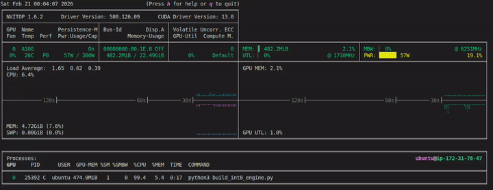
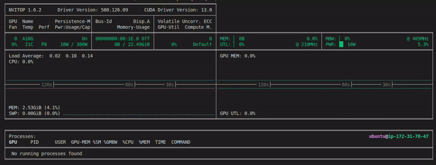

# Quantizing an ONNX Model to a TensorRT INT8 Engine

This document explains the process of converting an ONNX model to a quantized INT8 TensorRT engine. This process, known as Post-Training Quantization (PTQ), can significantly improve inference performance and reduce memory usage with a minimal loss in model accuracy.

The works are done in AWS g4.4xlarge instance with Deep Learning OSS Nvidia Driver AMI GPU PyTorch 2.9 (Ubuntu 24.04) ami-0f3d7b789119ccbfa.

We will refer to the `build_int8_engine.py` script as a practical example.

## Key Concepts

### 1. Post-Training Quantization (PTQ)

PTQ is a technique to convert a pre-trained FP32 model to a lower-precision representation, like INT8, without needing to retrain the model. This is achieved by analyzing the distribution of weights and activations in the model.

### 2. The INT8 Calibrator

To perform INT8 quantization, TensorRT needs to determine the dynamic range (min and max values) of the intermediate activation tensors in the network. This is the job of a **calibrator**. The calibrator feeds a representative set of input data through the network and records the activation ranges.

TensorRT provides several calibrator interfaces. The script uses `trt.IInt8MinMaxCalibrator`, which is a common choice.

### 3. Calibration Data

The accuracy of the quantized model heavily depends on the **calibration data**. This data should be a small, representative subset of your validation dataset. It needs to cover the expected distribution of inputs that the model will see during inference. In the script, this data is loaded from the `calib_data` directory.

### 4. Calibration Cache

The calibration process can be time-consuming. TensorRT allows you to cache the calibration results to a file. On subsequent runs, if the network and the calibrator have not changed, TensorRT can load the cache file to skip the calibration process, speeding up engine creation. In the script, this is handled by `read_calibration_cache` and `write_calibration_cache`.

## INT8 Quantization and Calibration

Calibration is the process of finding the actual range of floating-point values that flow through your model during inference. By feeding the model a small, representative sample of your data, TensorRT can observe the real-world minimum and maximum values for each layer's activations. This allows it to create a much more precise and tailored mapping to the INT8 range, which is the key to preserving accuracy.

### What Was Created for Calibration?

In this project, two main components were created specifically for this purpose, as defined in `build_int8_engine.py`:

1.  **The `MyCalibrator` Class:** This is a custom Python class that acts as a data provider for TensorRT. It inherits from TensorRT's `IInt8MinMaxCalibrator` and its job is to feed batches of calibration data to the TensorRT builder.

2.  **The Calibration Dataset (`calib_data` directory):** This directory holds the actual data used for the calibration process. It contains pre-processed, real-world examples of inputs that the MPNet model would expect to see.

### How Does It Work?

When you run `python build_int8_engine.py`, the following sequence of events occurs for calibration:

1.  **TensorRT Asks for Data:** The TensorRT builder detects that it needs to perform INT8 calibration and calls the `get_batch()` method of your `MyCalibrator` object.
2.  **Data Provisioning:** Your `get_batch()` method loads a batch of data from the `.npy` files in the `calib_data` directory, copies it to the GPU, and returns the GPU memory pointers to TensorRT.
3.  **TensorRT Observes Activations:** TensorRT performs a forward pass through the network using the provided data. It records the minimum and maximum activation values for every tensor in the graph. This is repeated for all the calibration batches.
4.  **Calculating Scaling Factors:** After processing all batches, TensorRT uses the collected statistics to calculate a "scaling factor" for each tensor, which is used to map the observed floating-point range to the INT8 range.
5.  **Caching the Results:** To save time on future runs, the `write_calibration_cache()` method is called to save these scaling factors to a `calibration.cache` file. On subsequent runs, this file is loaded, and the calibration process is skipped.

## The Quantization Workflow in `build_int8_engine.py`

The script [build_int8_engine.py](build_int8_engine.py) is used to convert the ONNX model to a quantized INT8 TensorRT engine. You can run it using the following command:

```bash
python build_int8_engine.py
```

The script demonstrates the end-to-end process of creating an INT8 engine.

### Step 1: Standard TensorRT Initialization

The script starts by creating the standard TensorRT objects:

-   `trt.Logger`: For logging TensorRT messages.
-   `trt.Builder`: The main object for creating an engine.
-   `trt.INetworkDefinition`: To define the network structure.

```python
logger = trt.Logger(trt.Logger.INFO)
builder = trt.Builder(logger)
network = builder.create_network(1 << int(trt.NetworkDefinitionCreationFlag.EXPLICIT_BATCH))
```

### Step 2: Parsing the ONNX Model

The pre-trained ONNX model is loaded and parsed to populate the network definition.

```python
parser = trt.OnnxParser(network, logger)
with open("path/to/your/model.onnx", "rb") as model:
    parser.parse(model.read())
```

### Step 3: Configuring the Builder for INT8

This is the crucial step where we instruct TensorRT to build an INT8 engine.

1.  **Create a Builder Config**: This object holds the configuration for the engine build.
2.  **Set the INT8 Flag**: This flag tells the builder to quantize the network to INT8.

```python
config = builder.create_builder_config()
config.set_flag(trt.BuilderFlag.INT8)
```

### Step 4: Implementing the Calibrator (`MyCalibrator`)

The script defines a class `MyCalibrator` that inherits from `trt.IInt8MinMaxCalibrator`. Here is the implementation:

```python
# Simple calibrator for demonstration
class MyCalibrator(trt.IInt8MinMaxCalibrator):
    def __init__(self, data_dir, cache_file):
        trt.IInt8MinMaxCalibrator.__init__(self)
        self.data_dir = data_dir
        self.cache_file = cache_file
        self.batch_size = 1
        self.input_names = ["input_ids", "attention_mask"]
        self.input_files = {
            "input_ids": np.load(os.path.join(self.data_dir, "input_ids.npy")),
            "attention_mask": np.load(os.path.join(self.data_dir, "attention_mask.npy"))
        }
        self.current_index = 0
        self.device_inputs = {}
        for name in self.input_names:
            self.device_inputs[name] = cuda.mem_alloc(self.input_files[name][0].nbytes * self.batch_size)

    def get_batch_size(self):
        return self.batch_size

    def get_batch(self, names):
        if self.current_index + self.batch_size > self.input_files["input_ids"].shape[0]:
            return None
        
        batch_data = {}
        for name in self.input_names:
            batch_data[name] = self.input_files[name][self.current_index:self.current_index+self.batch_size]

        for name in names:
            cuda.memcpy_htod(self.device_inputs[name], batch_data[name])
        
        self.current_index += self.batch_size
        return [int(self.device_inputs[name]) for name in names]

    def read_calibration_cache(self):
        if os.path.exists(self.cache_file):
            with open(self.cache_file, "rb") as f:
                return f.read()

    def write_calibration_cache(self, cache):
        with open(self.cache_file, "wb") as f:
            f.write(cache)
```

-   **`__init__`**: Initializes the calibrator, loading the calibration data and allocating CUDA memory for the inputs.
-   **`get_batch_size()`**: Returns the batch size of the calibration data.
-   **`get_batch()`**: This is the core method. TensorRT calls this repeatedly to get batches of calibration data. The data is copied from the host (CPU) to the device (GPU).
-   **`read_calibration_cache()` / `write_calibration_cache()`**: These methods handle loading and saving the calibration cache.

### Step 5: Setting the Calibrator

The builder configuration is updated with an instance of our calibrator.

```python
calibrator = MyCalibrator("calib_data", "calibration.cache")
config.int8_calibrator = calibrator
```

### Step 6: Building and Saving the Engine

Finally, the builder uses the network definition and the INT8 configuration to build the quantized engine. The resulting engine is then serialized to a file for later use in inference.

```python
engine = builder.build_serialized_network(network, config)
with open("mpnet-int8.engine", "wb") as f:
    f.write(engine)
```

Here is a screen capture of the GPU activity during this process:



By following these steps, you can leverage TensorRT's PTQ capabilities to optimize your models for high-performance inference on NVIDIA GPUs.

## Inference with the INT8 Engine

After building the INT8 engine, the next step is to use it for inference. The script [inference-int8-trt.py](inference-int8-trt.py) is used to run inference with the generated INT8 engine. You can launch it with the following command:

```bash
python inference-int8-trt.py
```

The process is similar to running inference with a non-quantized engine, but you will be loading the `.engine` file you just created.

Here is a screen capture of the GPU activity during inference with the INT8 engine:



This shows that inference is executed successfully in GPU.
